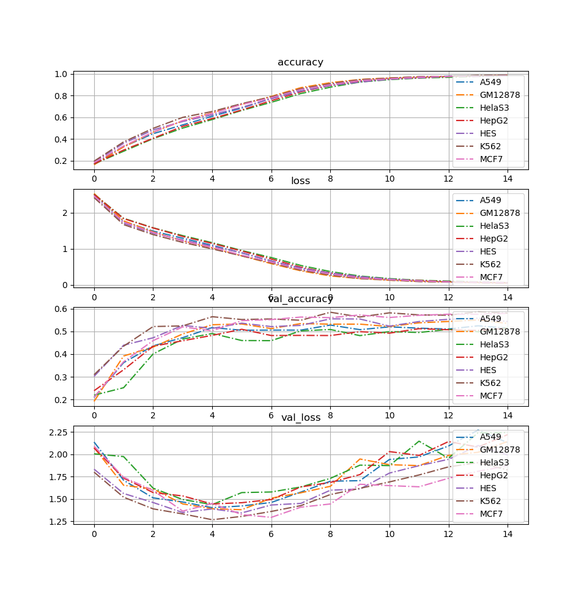

## Welcome to GitHub Pages

You can use the [editor on GitHub](https://github.com/mgcha85/D-mirt/edit/master/index.md) to maintain and preview the content for your website in Markdown files.

Whenever you commit to this repository, GitHub Pages will run [Jekyll](https://jekyllrb.com/) to rebuild the pages in your site, from the content in your Markdown files.

### Markdown

Markdown is a lightweight and easy-to-use syntax for styling your writing. It includes conventions for

```markdown
Syntax highlighted code block


training result by cell lines. X-axis is epoch and y-axis is in the title.

